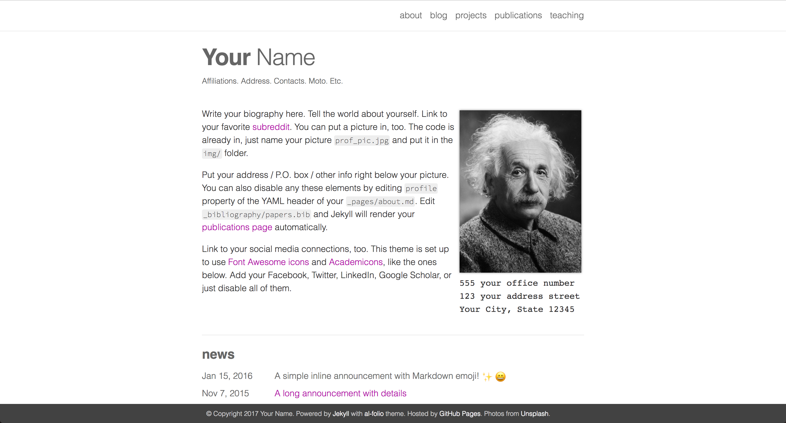

# al-folio

A simple and clean [Jekyll](https://jekyllrb.com/) theme for academics.

Originally, **al-folio** was based on the [\*folio theme](https://github.com/bogoli/-folio) (published by [Lia Bogoev](http://liabogoev.com) and under the MIT license).
Since then, it got a full re-write of the styles and many additional cool features.
The emphasis is on whitespace, transparency, and academic usage: [theme demo](https://alshedivat.github.io/al-folio/).

## Getting started with Atom

First, download [Atom](https://atom.io/) and follow the instructions. Atom is a free text editor affiliated with GitHub that makes editing and sorting code much easier! Afterwards, access our [GitHub portal](https://github.com/ichung-lab/ichung-lab.github.io) and click on the green "Code" button. A drop-down menu will appear, and click the "Download ZIP" option to download our code, and afterwards you should unzip the folder. In the folder, you will find these items called "index". These indexes contain the main code that build the website. For example, to access the code that creates the "papers" tab on the website, enter the "papers" folder and you will find an index which has the code that makes the "papers" tab. To edit the index, open Atom and drag the index from the folder to Atom. It will display all the code in a neat and orderly manner for ease of editing!

## Installation of Jekyll and Ruby

Next you will need to download [Jekyll and Ruby](https://jekyllrb.com/docs/installation/). Jekyll and Ruby work together to create a static site generator where you can quickly see how the website will update with any changes you make in the code. From the installation page, look at the bottom of the page and click on which operating system you will be using and follow the given instructions.

### Windows

The following instructions here will help you download Jekyll and Ruby if your operating system is Windows. Open [Jekyll on Windows](https://jekyllrb.com/docs/installation/windows/) if you haven't done so already, as this website will also give you instructions for installation with Windows. Next, open the [RubyInstaller Downloads](https://rubyinstaller.org/downloads/) page, and under "WITH DEVKIT", it is recommended that you download the "Ruby+Devkit 2.7.4-1 (x64)" version. Follow the instructions and make sure to check the box at the last step that asks to run "ridk install".

Next, open a new command prompt window and install Jekyll and Bundler by typing "gem install jekyll bundler". To make sure if Jekyll was installed properly, type "jekyll -v". You can also make sure Ruby and RubyGems are installed properly by typing "ruby -v" and "gem -v" respectively.

Next, you will want to link the folder with the code to the static site. First, open the command prompt and type "cd (INSERT FILE PATH TO FOLDER)". An example of this is "cd C:\Users\pnalamalapu\Downloads\chunglab-website". Next type "bundle exec jekyll serve" and this will create the static site with the code in your folder!

### Editing the website

By now, the installation process is complete! The following information will help you get started with an efficient method of editing the website.

First, make sure you have your command prompt open after following the instructions above. Once you type "bundle exec jekyll serve" in the last step, go to [http://localhost:4000](http://localhost:4000/) in you browser, and this is your static site that will show your website product with your current updates to the code. Let's say you want to update code to change content in the "downloads" tab in the website. Enter the "downloads" folder and drag the index to Atom. Edit the code as you see fit, and save the code by pressing "Ctrl+S" or by clicking "File" at the top left and clicking on "Save". Afterwards, go back to your [static site](http://localhost:4000/) and refresh the page. All of your updates to the code will be displayed on the static site: it's that easy!

Once you are satisfied with the updates you have made to the code, create a pull request so your changes can be merged to the code for the official website!
